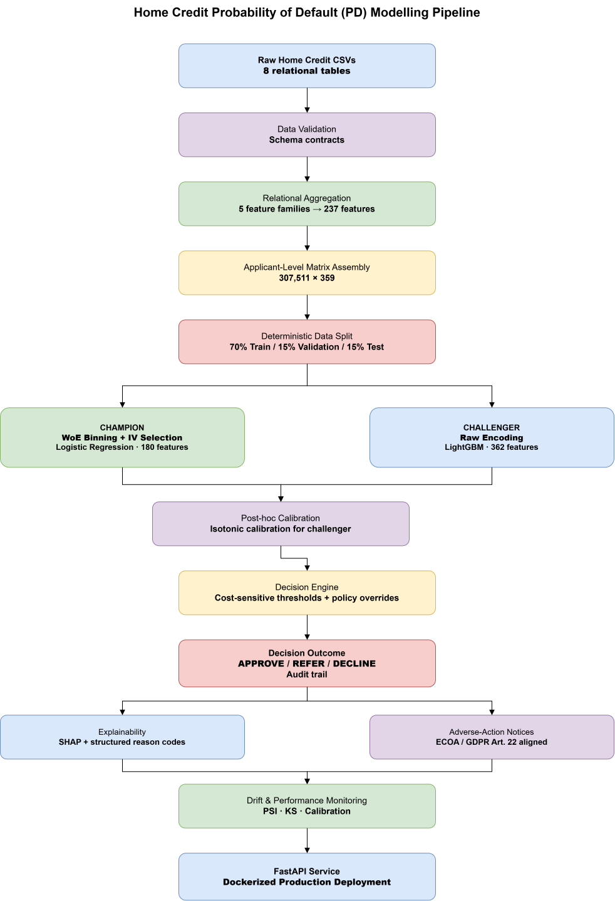

# Credit Risk — Probability of Default (PD) System

A production-grade **Probability of Default** modelling system built on
the public Home Credit Default Risk dataset. The system estimates a loan
applicant's probability of default at application time, converts that 
probability into a business decision, explains the decision, and monitors
itself for drift.

This is not a notebook or a Kaggle submission. It is an end-to-end system
with the data contracts, calibration, explainability, monitoring, and
governance that a real credit risk deployment requires.

---

## Key Results

| Model | Holdout AUC | Gini | KS | Brier | Calibration slope |
|---|---:|---:|---:|---:|---:|
| Champion (Elastic-Net LR, WoE) | 0.7722 | 0.5443 | 0.4136 | 0.0671 | 1.005 |
| **Challenger (LightGBM, raw)** | **0.7846** | **0.5692** | **0.4308** | **0.0658** | 0.979 |

The challenger reduces expected cost by **~2%** across cost ratios
from 5:1 to 50:1 (see [`docs/champion_challenger.md`](docs/champion_challenger.md)).

The API serves **`/score`** at under 100 ms p99, with a full
explainability endpoint producing regulator-compliant adverse-action
notices.

---

## What the System Does
<p align="center">
  
</p>

<p align="center">
  <em>End-to-end production-oriented Probability of Default modelling architecture.</em>
</p>

### Interactive Diagram

[Open the editable diagrams.net architecture](./home_credit_pd_pipeline.drawio)


## Documents

- [Problem Statement](docs/problem_statement.md) — v2.0
- [Model Card](docs/model_card.md) — v2.0
- [Data Quality Report](docs/data_quality_report.md) — populated after inspection

## Quickstart

```bash
python -m venv .venv
source .venv/bin/activate
pip install -e ".[dev]"

# Place Home Credit CSVs in data/raw/home_credit/

python scripts/inspect_data.py
